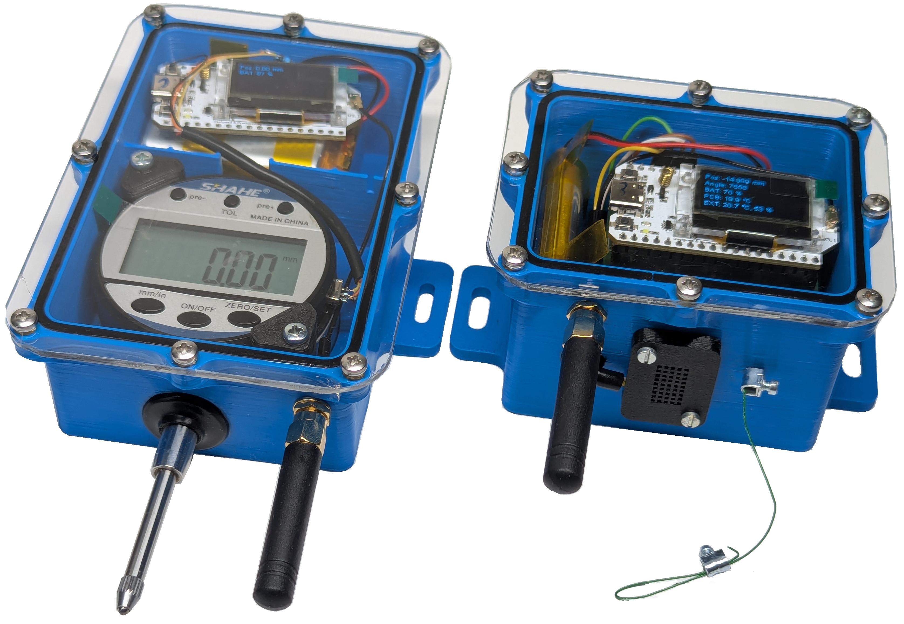

# Open Source Low-cost IoT Crack Monitoring Sensor System

## Introduction

Cracks in buildings and infrastructure can pose safety risks if left unmonitored. Traditional commercial solutions can be prohibitively expensive, so this project was created to provide a cost-effective alternative. Here, you will find open-source hardware designs, firmware, and backend software needed to set up a complete, network-connected crack monitoring solution.

This project provides two different sensor designs for monitoring the width of existing cracks:
- A 3D-printable long range **draw-wire sensor** using a magnetic encoder and custom PCB.
- A **digital dial indicator sensor (shahe sensor)** offering reliable and accurate readings using a off the shelf digital dial indictor of the brand SHAHE.

Both sensors are designed to operate on battery power with LoRaWAN connectivity, and a corresponding backend is provided to visualize data in real-time using MQTT, InfluxDB, and Grafana. The goal is to make structural health monitoring both accessible and affordable.

## Hardware Overview and Specifications

The main communication module for both sensors is the **Heltec WiFi LoRa 32 (V3)**, which supports a deep sleep current of approximately **21 µA**. Beyond the LoRa radio, it also integrates an OLED display and a Li-ion battery charging and protection circuit.

For the **draw-wire sensor**, the temperature, humidity, and hall angle sensors connect via I²C. Meanwhile, the **digital dial indicator sensor** uses a proprietary serial protocol, read through a customized USB OTG cable.

### Sensor specs:

| Parameter               | Draw-Wire Sensor | SHAHE Sensor |
|-------------------------|------------------|----------------|
| Measurement Range       | 55 mm            | 26 mm          |
| Resolution              | 16 µm            | 10 µm          |
| Absolute Accuracy       | 96 µm            | 10 µm          |
| Repeatability           | ±16 µm           | ±10 µm         |
| Temperature Dependence  | 5 µm/°C*         | 0 µm/°C        |
| Position drift          | yes**            | no             |
| Battery Life            | ~11 months       | ~11 months     |
| Material Cost (excluding VAT)         | ~€48.50          | ~€65           |

*Temperature compensation of the draw-wire sensor is not implemented yet.

**During a 7-week long-term test, the draw-wire sensor exhibited a permanent position offset of more than 0.1 mm. This requires further investigation.

## Communication and Backend
The sensor data is transmitted hourly via LoRaWAN. [The Things Network](https://www.thethingsnetwork.org/) can be used as a provider for the LoRaWAN backend, or a self-hosted version such as [Chripstack](https://www.chirpstack.io/).
The data must be transferred from the LoRaWAN backend to a dedicated server via MQTT and stored in a database ([InfluxDB](https://github.com/influxdata/influxdb)). A Grafana dashboard is used to visualise the data.

## Repository Overview

- **draw-wire-sensor/**  
  Contains the 3D-printable hardware design, a PCB project, and the firmware source code for the draw-wire sensor.
- **shahe-sensor/**  
  Provides the hardware documentation and firmware to integrate the commercially available Shahe digital indicator.
- **backend/**  
  Contains Docker configurations, scripts, and a Grafana dashboard for storing, processing, and visualizing crack measurements.

More information and detailed assembly as well as usage instructions can be found in the respective subfolders.

## Credits

We would like to acknowledge the following open-source software libraries and frameworks that have made this project possible:
- [heltec_esp32_lora_v3 by Rop Gonggrijp](https://github.com/ropg/heltec_esp32_lora_v3) for providing the easy to use Heltec WiFi LoRa 32(V3) library
- [LoRaWAN_ESP32 by Rop Gonggrijp](https://github.com/ropg/LoRaWAN_ESP32) for LoRaWAN persistence handling
- [RadioLib](https://github.com/jgromes/RadioLib) for LoRaWan communication handling
- [PlatformIO](https://platformio.org/) for easy firmware development and deployment
- [Arduino Core](https://github.com/arduino/Arduino) for base microcontroller support
- [Docker](https://www.docker.com/) for containerization
- [Grafana](https://grafana.com/) for data visualization
- [InfluxDB](https://www.influxdata.com/) for time-series database storage

## Disclaimer

This Project is not completely finalized and may undergo changes. Use at your own risk.

## License

This project is available under the [MIT License](./LICENSE).