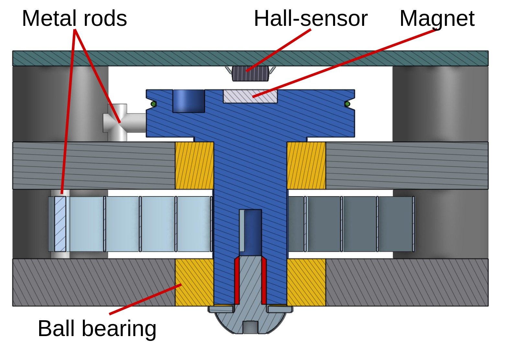
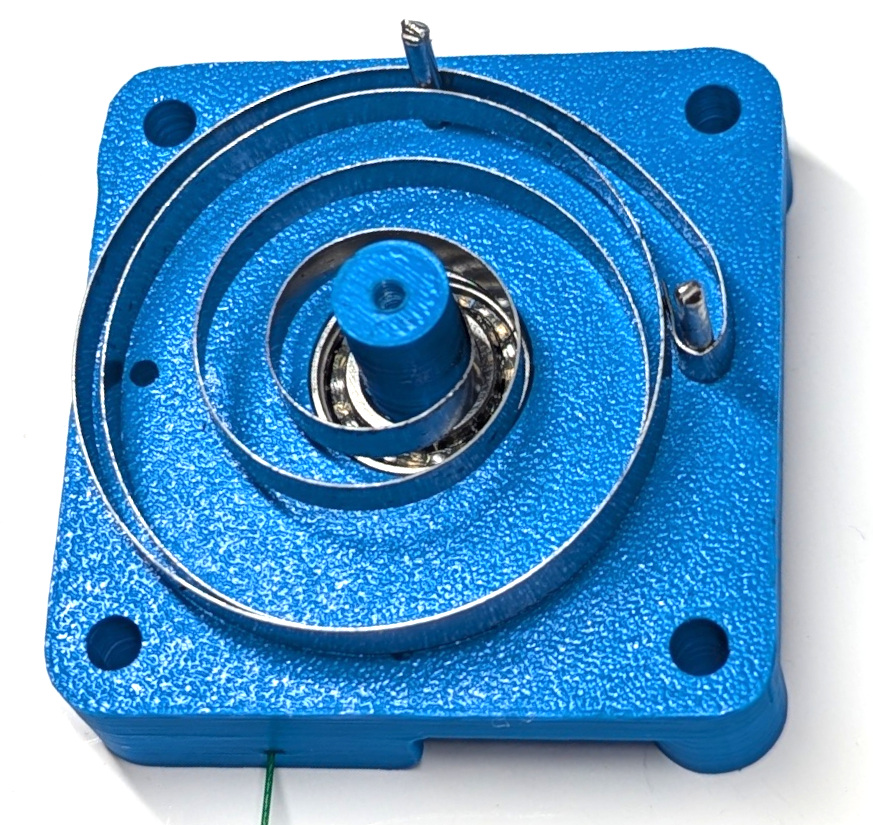
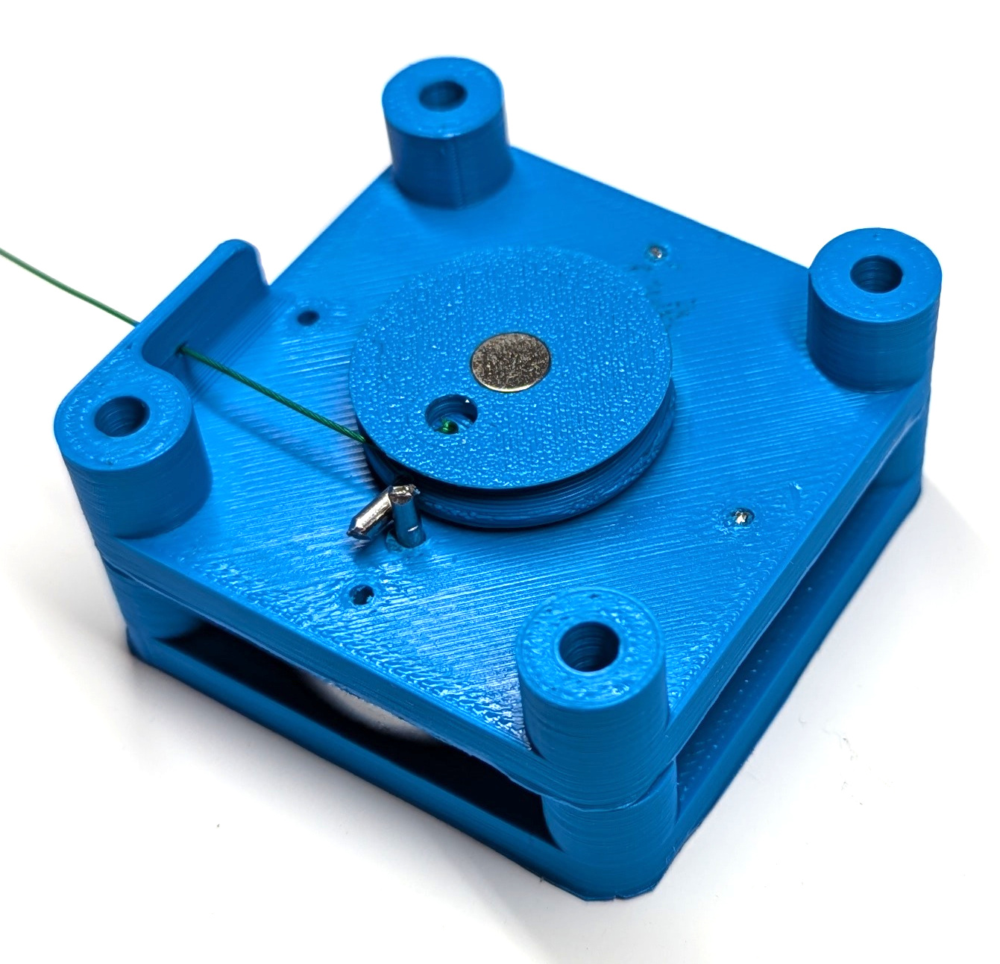
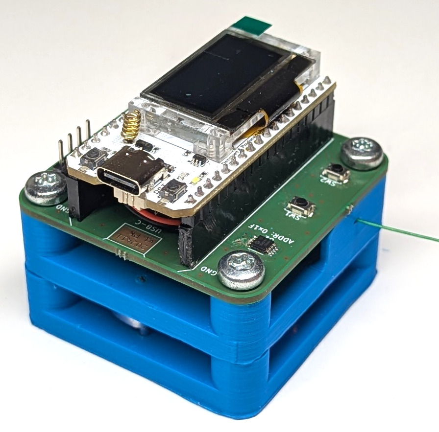

# Draw-Wire Crack Sensor Hardware

## Draw-Wire Sensor
[3D-model Onshape Link](https://cad.onshape.com/documents/727012fc8109642ef30e330c/w/04f195b811331b23b33eb80b/e/cc3c6dd55492ae3cabf4f177?renderMode=0&uiState=67e1a618d2f76412aff66577)

### Functionality

### Materials
- 3D printed parts (Spool, BearingHolder1, BearingHolder2)
- Hall sensor PCB
- 8x16x5 mm ball bearing
- 0.2x5x420 mm spring
- 2 mm steel rod (2 pcs. 12 mm, 2 pcs. 8 mm) e.g. a bicycle spoke
- 0.5 mm steel wire (100 mm)
- Diametrical magnet (6 mm diameter, 1 mm thick)
- M4x8 button head screw and M4 washer
- M4x30 screws (4 pcs.)
- Single screw terminal as wire stopper

### Tools
- 3D Printer
- Soldering iron, solder, flux, and solder wick
- Round-nose pliers
- Tongue-and-groove pliers
- 2 mm drill bit

### Assembly
1. Assemble the PCB.
2. Print the parts (100% infill, 0.1 mm layer height).
3. Insert (and glue) the magnet into the spool with maximum precision.
4. Press-fit the bearings into the bearing-holders.
5. Press-fit the steel rods into the spool and upper bearing-holder (you may need to slightly drill out the holes beforehand).
6. Bend the spring as shown in the picture using round-nose pliers.
7. Insert the spool and then the spring.
8. Add the lower bearing-holder and slightly tighten the button head screw on the bottom of the spool.

## Enclosure
[3D-model Onshape Link](https://cad.onshape.com/documents/93da92487be01dacccf96228/w/5f335a3fbf208dbb23918342/e/3e6e6e181994376e8e597439?renderMode=0&uiState=67e194bb183653275da219e5)

### Materials
- 3D printed enclosure (ASA)
- Acrylic glass (2 mm) or 3D printed lid
- Short M3 inserts (8 pcs.)
- Short M4 inserts (4 pcs.)
- Short M2 inserts (2 pcs.)
- M3x6 screws (8 pcs.)
- M2x5 screws (2 pcs.)
- EPDM sealing cord (255 mm)
- Rubber grommet
- Acrylic paint / conformal coating / 3D-print sealant
- Silicone grease

### Tools
- 3D Printer
- Soldering iron
- 3.5 mm drill bit and drill
- Cutter knife

### Assembly
1. Print the enclosure (100% infill, 0.15 mm layer height).
2. Seal the print with spray paint.
3. Print the lid template (0.5 mm).
4. Transfer the template to acrylic glass and cut out the outlines.
5. Drill 3.5 mm screw holes in the lid.
6. Use a soldering iron to melt in the inserts.
7. Lubricate the seal and the grommet with silicone grease and insert them.

## Additional information
- With a longer string multiple parallel cracks can be monitored at once

## Future Improvements / To-Dos / Ideas
- Create a parametric 3D design for the draw-wire sensor and the enclosure using FreeCAD.
- Add a 3D printable adapter for standalone use of the draw-wire sensor with standard AS5600/MT6701 modules.
- Investigate the impact of hall sensor magnet alignment on accuracy and hysteresis.
- Further investigate the permanent drift of the sensor position
